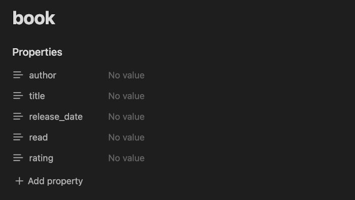
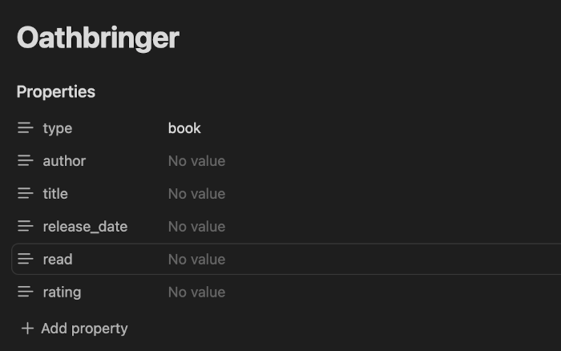

# Obsidian Dataclass

For those users of [Obsidian.md](https://obsidian.md/) that use properties (frontmatter) to organize their data. Dataclass helps you maintain consistency between your file's properties as it changes and evolves. Define your properties in a class file, assign one of your notes to a class and it's properties will be updated to keep with the class definition. Compatible with update 1.4.

## Features

-   Keep your Notes updated with a class definition
-   Add new properties to all the notes pertaining to a class
-   Keep properties sorted by different criteria
-   Rename a property for all files of a class
-   Can be integrated [templater](https://github.com/SilentVoid13/Templater) or similar tools.
-   All your important configuration/data is kept in your notes

## Usage

To start using the plugin, configure a directory for your dataclas definition files.

### Create a class definition

To create a new class definition file, do the following:

1.  Create a Note on the directory you configured in the plugin settings.
2.  The class name will be the file name.
3.  Add your desired properties to the file and optionally default values for them too, you can use templating language.
4.  Optionally you can add contents to the note and they and will be copied to a file if the file's contents are empty.

### Add a note to a class

1. Check in the plugin settings that the classs property is set. Default is `type`.
2. Add the property to your note with the class name as value:

3. [Run the command](https://help.obsidian.md/Plugins/Command+palette) `Dataclass: Apply the class to the current file`. All the class properties and contents should appear on the file, like this:

4. Optionally you can enable _Apply class on Save_ in the plugin's settings so that the file is updated each time you save it.

### Renaming fields/classes or updating all notes pertaining to a class

Open one of your class definitions, and [execute](https://help.obsidian.md/Plugins/Command+palette) one of the following commands:

-   Rename a field: Rename a field in the current class definition
-   Dataclass: Rename current class file
-   Dataclass: Update all files pertaining to the current class

### When is a class definition applied to a Note?

By default, only when executen a command that acts on the file. You can however enable _Apply class on Save_ in the settings so that it applies automatically each time you save the file. I recommend doing this after playing a little bit with the plugin.

## Roadmap

This is a broad overview of features that are planned for this plugin, in no particular order:

-   Class Inheritance
-   Support nested properties
-   Commands to generate dataview queries based on a class definition
-   Improve ease of use (feedback is welcome)

## Alternatives

-   https://github.com/mdelobelle/metadatamenu

## Contributing

You can contribute by creating an issue to report a bug, suggest features or ask a question.

You can make a pull request to contribute to this plugin development.

## Support/Donations

If this helped you and you can afford it, please consider buying me some coffe :)

<a href='https://ko-fi.com/supportkofi' target='_blank'>
